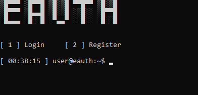

What is Eauth?
==============

https://eauth.us.to/ - Your #1 Free and Powerful Software Licensing Solution, Ultimately providing you with the most secure features and easy to use on an authentication system.    
  
Documentation
-------------

https://eauth.us.to/docs/


Configuration
-------------

Navigate to `eauth.py`, and fill these lines of code:

```python
/* Required configuration */
account_key = "" # Your account key goes here
application_key = "" # Your application key goes here
application_ID = "" # Your application ID goes here
application_version = "1.0" # Your application version goes here
```
